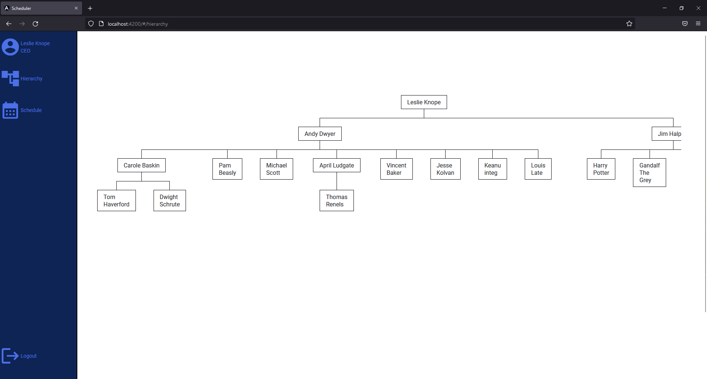
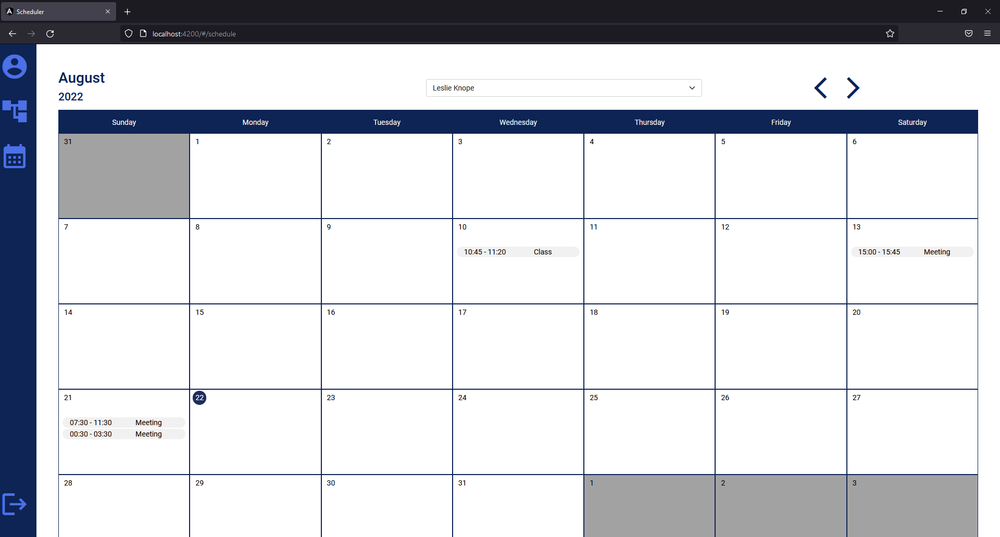
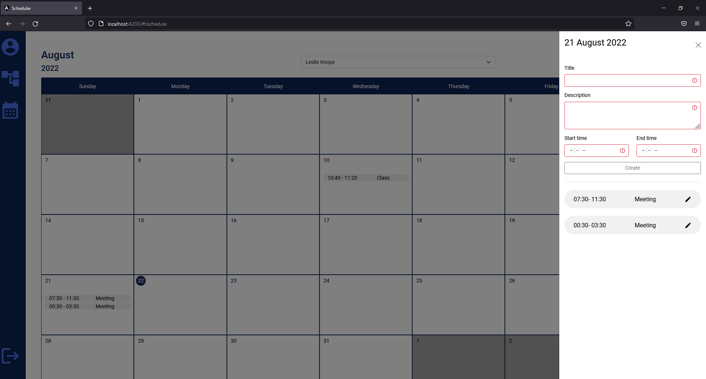
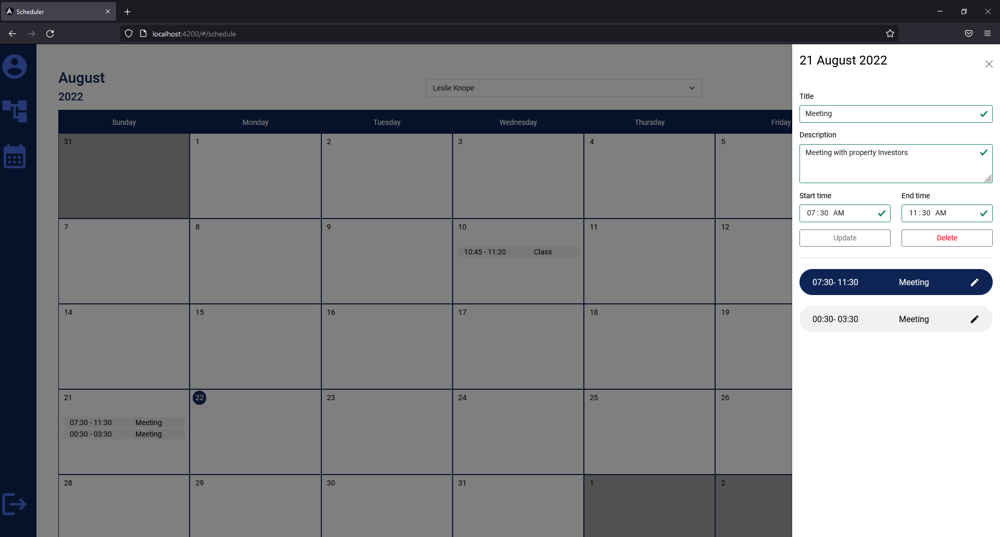
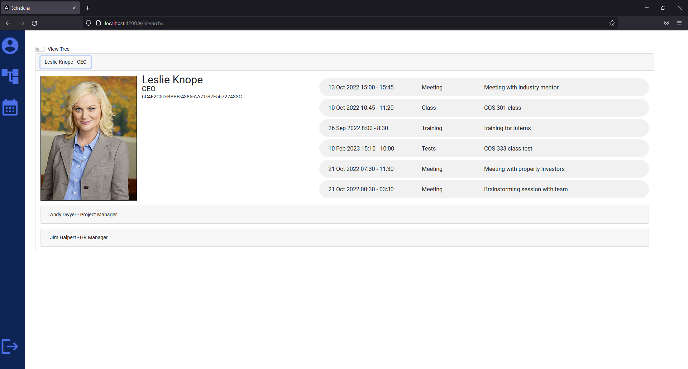
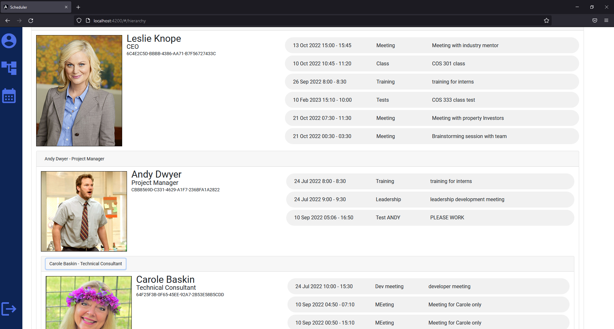
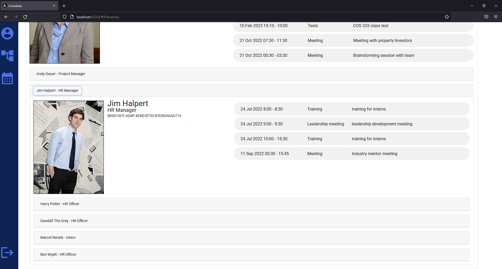
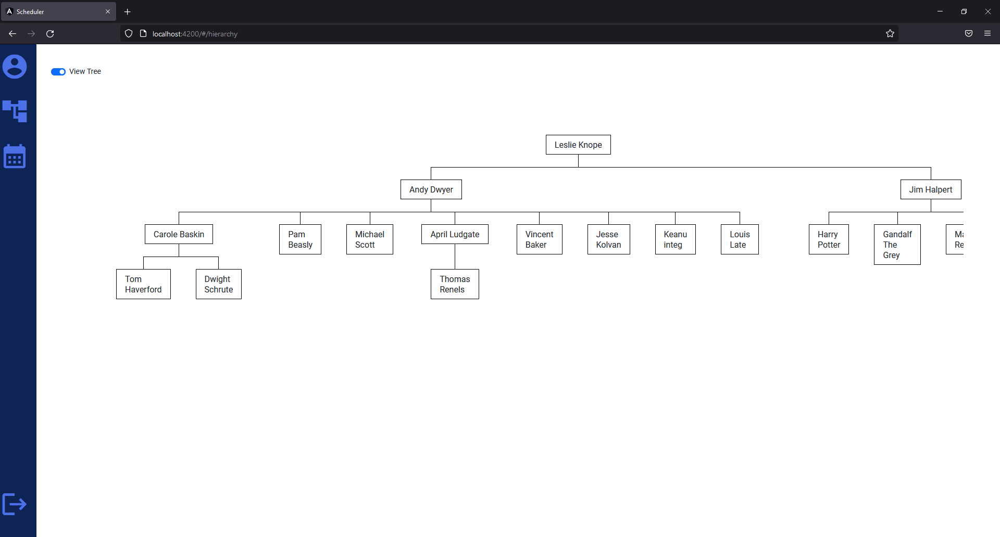
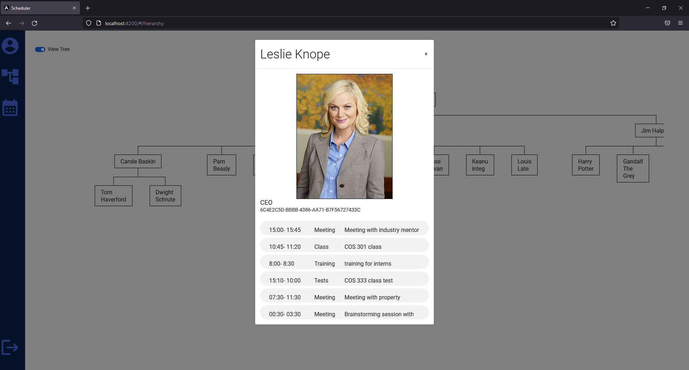
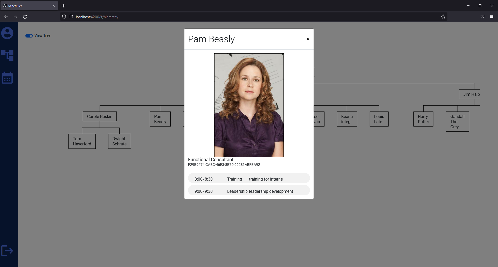

# Scheduler
## A recruitment exercise completed by Tshegofatsho Motlatle
- www.linkedin.com/in/tshegofatsho-motlatle-41ab89239
- motlatletshego@gmail.com

# System functionality
## Core functionality
- Login a user that is part of the organisation
- Create appointments for a logged in user
- Create appointment for a subodrinate of a logged in user
- Update appointments for a logged in user
- Update appointment for a subodrinate of a logged in user
- Delete appointments for a logged in user
- Delete appointment for a subodrinate of a logged in user
- Construct a hierarchy structure view of the logged in Employee and his subordinates 
- User can logout of the application

## Additional functionality
- Logged in user can edit their profile, which includes username, name surname and password
- Logged in user can have a profile picture asscoiated with their profile

# Setup Instructions 
## Downloads
- Download and install yarn from their website https://classic.yarnpkg.com/lang/en/docs/install/#windows-stable
- Download and install nodejs from their website https://nodejs.org/en/

## Install
- Open the terminal and navigate to the directory of this cloned repository 
- run the command "yarn install"
- run the command "yarn add @angular/cli"
- run the command "ng serve" and the application will be hosted on localhost:4200

# Application Screens

## Menu

## Calendar

## Create appointment window

## Update and Delete window

## Hierarchy collapsibles

## Hierarchy Tree

